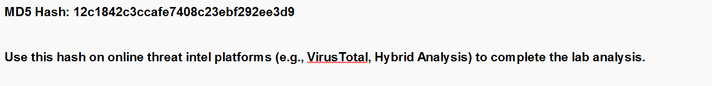
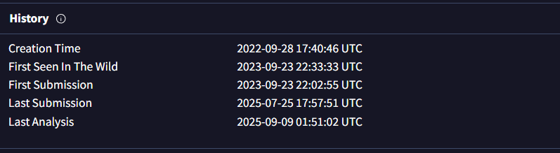
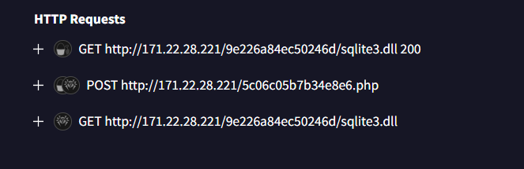
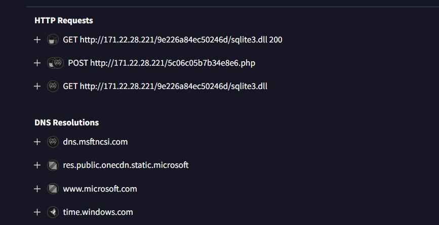
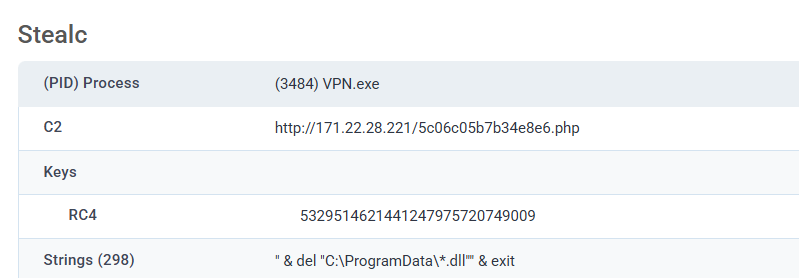
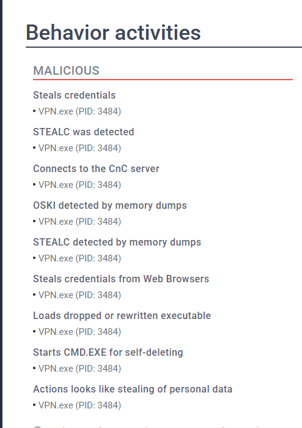
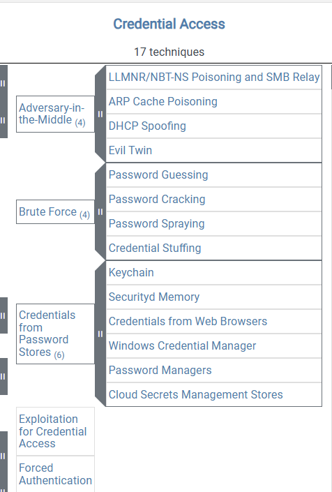

# Tiếp tục chinh phục từng lab tại CyberDefenders: SOC Level 1 - Oski Lab

*Mô tả: Kế toán tại công ty đã nhận được một email có tiêu đề "Lệnh mới khẩn cấp" từ một khách hàng vào cuối buổi chiều. Khi anh ta cố gắng truy cập hóa đơn đính kèm, anh ta phát hiện ra nó chứa thông tin đặt hàng sai. Sau đó, giải pháp SIEM đã tạo ra một cảnh báo liên quan đến việc tải xuống một tệp độc hại có khả năng. Sau khi điều tra ban đầu, người ta thấy rằng tệp PPT có thể chịu trách nhiệm cho việc tải xuống này. Bạn có thể vui lòng tiến hành kiểm tra chi tiết về tệp này?*

## Ở lab này trước tiên được cung cấp một file hash.txt. Yêu cầu sử dụng nền tảng VR và Hybrid Analysis để điều tra

### Câu 1: Xác định thời gian tạo của phần mềm độc hại có thể cung cấp cái nhìn sâu sắc về nguồn gốc của nó. Thời điểm tạo phần mềm độc hại là gì?

> Trước tiên mang MD5 hash lên Virus total để xem có những thông tin hữu ích gì cho chúng ta. Để lấy được thời gian tạo của tệp mã độc thì ta vào phần Detail sẽ thấy kết quả phù hợp.

> Kết quả thu được: *2022-09-28 17:40*

### Câu 2: Xác định máy chủ lệnh và điều khiển (C2) mà phần mềm độc hại giao tiếp có thể giúp truy tìm trở lại kẻ tấn công. Máy chủ C2 nào làm phần mềm độc hại trong tệp PPT giao tiếp với?

> Để trả lời câu này vào tab Behavior của tệp Virus total vừa tìm hiểu xem có điều gì thú vị không.

> Xác định được IP máy nạn nhân bị tấn công là **171.22.28.221**. Sau đó tìm các giao thức truy cập như TCP, HTTP...

> Nhưng trong trường hợp này chú ý vào HTTP request với phương thức POST để kiểm tra kết quả có phù hợp với pattern đáp án không

>Kết quả đúng là: *http://171.22.28.221/5c06c05b7b34e8e6.php*

### Câu 3: Xác định các hành động ban đầu của nhiễm phần mềm độc hại có thể cung cấp cái nhìn sâu sắc về các mục tiêu chính của nó. Thư viện đầu tiên mà phần mềm độc hại yêu cầu sau nhiễm trùng là gì?

> Được yêu cầu trở lời thư viện đầu tiên đồng nghĩa với đuôi file chỉ có thể là .lib hoặc .dll. Nhưng theo điều tra thì tệp thực thi là trên Window nên đuôi chắc chắn là .dll

> Tiếp theo đó chi cần tìm hiểu các đuôi .dll trên tab hành vi trước đó thôi và chỉ có 1 đáp áp phù hợp

> Kết quả đúng: *sqlite3.dll*

### Câu 4: Bằng cách kiểm tra báo cáo được cung cấp Any.run, khóa RC4 nào được sử dụng bởi phần mềm độc hại để giải mã chuỗi được mã hóa base64 của nó?

> Theo báo cáo của any run (https://any.run/report/a040a0af8697e30506218103074c7d6ea77a84ba3ac1ee5efae20f15530a19bb/d55e2294-5377-4a45-b393-f5a8b20f7d44). Đọc và lấy khóa RC4 rất đơn giản

>Kết quả: *5329514621441247975720749009*

### Câu 5: Bằng cách kiểm tra các kỹ thuật của MITER ATT & CK được hiển thị trong báo cáo hộp cát Any.Run, hãy xác định kỹ thuật MITRE chính (không phải sub-tech), phần mềm độc hại sử dụng để đánh cắp mật khẩu của người dùng.

> Để solve câu này cần điều tra kỹ một xíu nhé

> Trước tiên theo báo cáo của ANYRun về tệp mã độc sẽ thực hiện những kỹ thuật gì mà Mitre ATT&CK đề cập. Tại Behavior activity chúng ta chú ý đến Credential và credential from Web Browsers

 

> Bước tiếp theo chúng ta đi tìm và xác nhận các kỹ thuật liên quan đến kỹ thuật credential access trên Mitre ATT&CK

> Với thu thập trước đó liên quan đến credential from web browsers có ID là T1555.003. Nhưng đây là sub technique nên chọn technique cha nó là *Credentials from password store* có ID là T1555

>Kết quả: *T1555* 