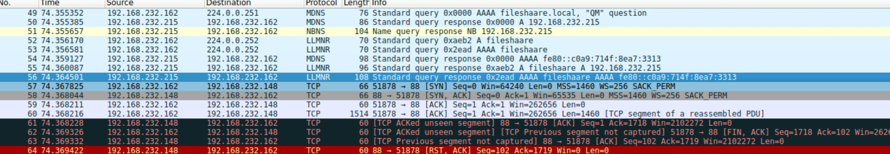

# Cyberdefenders: SOC Tier 1 - level 1 - PoisonedCredentials Lab

*Mô tả kịch bản: Đội bảo mật của tổ chức của bạn đã phát hiện ra sự gia tăng trong hoạt động mạng đáng ngờ. Có những lo ngại rằng LLMNR (độ phân giải tên phát đa hướng liên kết-local) và các cuộc tấn công ngộ độc NBT-NS (Dịch vụ tên NetBIOS) có thể xảy ra trong mạng của bạn. Các cuộc tấn công này được biết đến để khai thác các giao thức này để chặn lưu lượng mạng và có khả năng thỏa hiệp thông tin đăng nhập của người dùng. Nhiệm vụ của bạn là điều tra nhật ký mạng và kiểm tra lưu lượng truy cập mạng bị bắt.*

### Câu 1: Trong bối cảnh vụ việc được mô tả trong kịch bản, kẻ tấn công đã khởi xướng hành động của họ bằng cách tận dụng lưu lượng mạng lành tính từ các máy hợp pháp. Bạn có thể xác định truy vấn bị lỗi cụ thể được thực hiện bởi máy với địa chỉ IP không 192.168.232.162?

> Trước tiên trên mấy ảo được cung cấp bởi CyberDefenders ta tiến hành mở file .pcap để thực hiện điều tra.

> Ta có địa chỉ IP *192.168.232.162*, ta tiến hành dò các gói tin liên quan đến LLMNR sẽ thấy điều bất thường

> Dễ thấy có một cụm từ bị sai chính tả dẫn đến truy vấn sai

>Kết quả: *FILESHAARE*

### Câu 2: Chúng tôi đang điều tra một sự cố bảo mật mạng. Để tiến hành điều tra kỹ lưỡng, chúng tôi cần xác định địa chỉ IP của máy lừa đảo. Địa chỉ IP của máy đóng vai trò là thực thể lừa đảo là gì?
> Câu này tự điều tra siêu dễ

> Kết quả: *192.168.232.215*