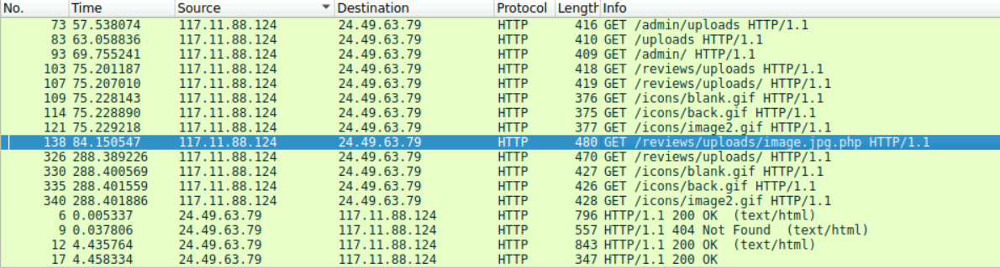
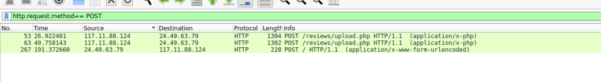
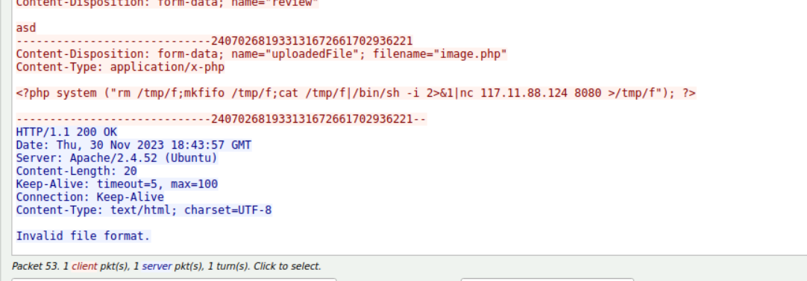
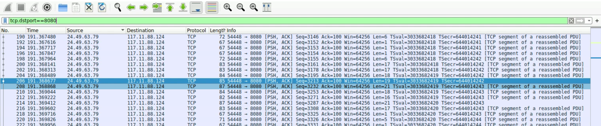
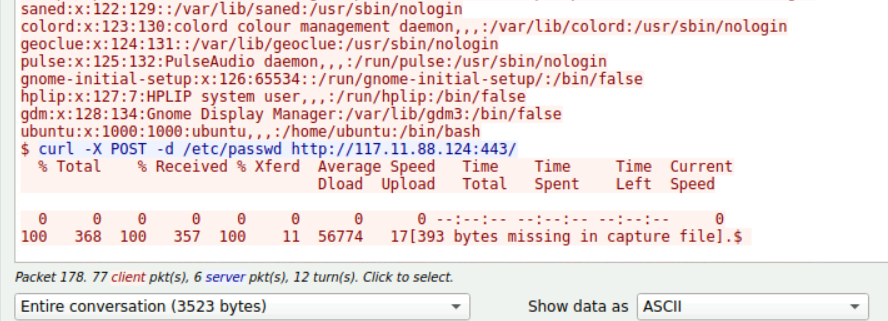

# Hướng dẫn giải lab trên Cyber Defenders - WebStrike Lab

Phân tích lưu lượng mạng bằng cách sử dụng Wireshark để điều tra sự thỏa hiệp của máy chủ web, xác định triển khai shell web, giao tiếp shell đảo ngược và tìm hiểu dữ liệu.

### Câu 1: Xác định nguồn gốc địa lý của cuộc tấn công tạo điều kiện cho việc thực hiện các biện pháp chặn địa lý và phân tích trí thông minh đe dọa. Cuộc tấn công bắt nguồn từ thành phố nào?

_Lưu ý: Các máy thí nghiệm không có quyền truy cập Internet. Để tra cứu địa chỉ IP và hoàn thành bước này, hãy sử dụng dịch vụ định vị địa lý IP trên máy tính cục bộ của bạn bên ngoài môi trường phòng thí nghiệm._

> Để giải quyết câu này trước tiên mở tệp pcap lên vào điều tra tìm thấy ip đáng ngờ "117.11.88.124"

> Sau đó sử dụng công cụ hoặc dùng nền tảng tra cứu IP có tên AbuseIPDB để kiểm tra xem IP trên thuộc thành phố nào.

> Kết quả tra cứu cho thấy nó thuộc thành phố Tianjin (Thiên Tân) của Trung Quốc.

### Câu 2: Biết được User-Agent của kẻ tấn công hỗ trợ trong việc tạo ra các quy tắc lọc mạnh mẽ. Tên User-agent đầy đủ của kẻ tấn công là gì?
> Follow stream vào bất kì gói tin nào có IP tấn công đã điều tra trước đó để xem User-agent

> Kết quả: Mozilla/5.0 (X11; Linux x86_64; rv:109.0) Gecko/20100101 Firefox/115.0

### Câu 3: Chúng ta cần xác định xem có bất kỳ lỗ hổng nào được khai thác không. Tên của malicious web shell đã được tải lên thành công?
> Trở lại với vấn đề tìm file shell mà kẻ tấn công đã upload thành công lên hệ thống nạn nhân.

> Dựa vào định dạng kết quả thì file được up lên có mẫu aaaa.bbb.ccc theo hướng này chỉ cần chú ý các gói tin liên quan

### Câu 4: Xác định thư mục nơi lưu trữ các tệp được tải lên là rất quan trọng để định vị trang dễ bị tổn thương và xóa bất kỳ tệp độc hại nào. Thư mục nào được trang web sử dụng để lưu trữ các tệp đã tải lên?

> Tương tự câu trên, khá là dễ suy ra từ thư mục trên chỉ ra /reviews/uploads/ là đáp án.

### Câu 5: Cổng nào, được mở trên máy của kẻ tấn công, được nhắm mục tiêu bởi Shell Web độc hại để thiết lập giao tiếp bên ngoài trái phép?
> Để solve câu này trước tiên tìm theo truy vấn các gói tin http theo phương thức post: http.request.method == POST

> Tiếp đến, follow stream HTTP gói tin có IP tấn công nghi ngờ đã tìm trước đó. 

> Đọc và thấy đáp án cổng cần tìm: 8080

### Câu 6: Nhận thức được tầm quan trọng của dữ liệu bị xâm phạm giúp ưu tiên các hành động ứng phó sự cố. Tệp nào là kẻ tấn công cố gắng thoát ra?
> Từ câu 5 ta thấy được port mà kẻ tấn công sử dụng upload web shell lên hệ thống là 8080. Sử dụng  tcp.dstport ==8080 để lọc các gói tin mà attacker cố gắng thoát ra.

> Follow stream và tìm các từ liên quan curl. Kết quả sẽ là passwd

*the end lab*