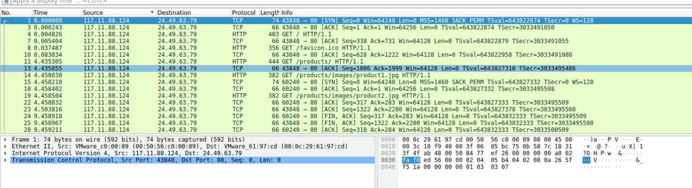
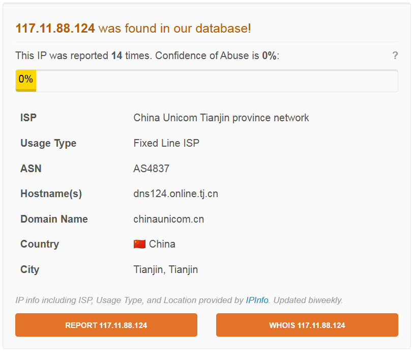
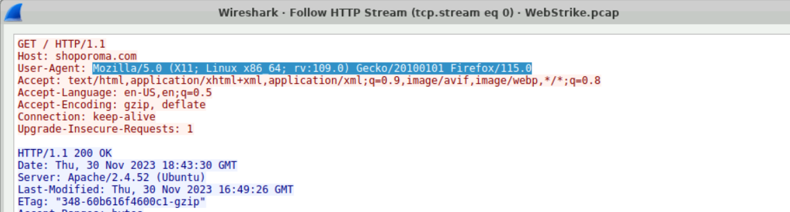

# Hướng dẫn giải lab trên Cyber Defenders - WebStrike Lab

Phân tích lưu lượng mạng bằng cách sử dụng Wireshark để điều tra sự thỏa hiệp của máy chủ web, xác định triển khai shell web, giao tiếp shell đảo ngược và tìm hiểu dữ liệu.

### Câu 1: Xác định nguồn gốc địa lý của cuộc tấn công tạo điều kiện cho việc thực hiện các biện pháp chặn địa lý và phân tích trí thông minh đe dọa. Cuộc tấn công bắt nguồn từ thành phố nào?

_Lưu ý: Các máy thí nghiệm không có quyền truy cập Internet. Để tra cứu địa chỉ IP và hoàn thành bước này, hãy sử dụng dịch vụ định vị địa lý IP trên máy tính cục bộ của bạn bên ngoài môi trường phòng thí nghiệm._

> Để giải quyết câu này trước tiên mở tệp pcap lên vào điều tra tìm thấy ip đáng ngờ "117.11.88.124"

> Sau đó sử dụng công cụ hoặc dùng nền tảng tra cứu IP có tên AbuseIPDB để kiểm tra xem IP trên thuộc thành phố nào.

> Kết quả tra cứu cho thấy nó thuộc thành phố Tianjin (Thiên Tân) của Trung Quốc.

### Câu 2: Biết được User-Agent của kẻ tấn công hỗ trợ trong việc tạo ra các quy tắc lọc mạnh mẽ. Tên User-agent đầy đủ của kẻ tấn công là gì?
> Follow stream vào bất kì gói tin nào có IP tấn công đã điều tra trước đó để xem User-agent

> Kết quả: Mozilla/5.0 (X11; Linux x86_64; rv:109.0) Gecko/20100101 Firefox/115.0